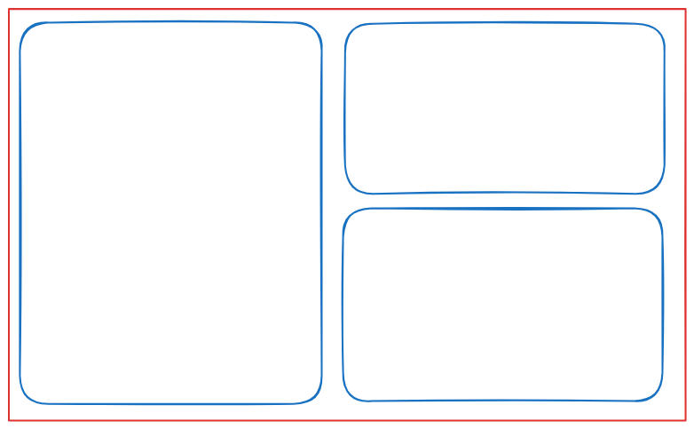

+++
date = '2025-12-15T22:52:13-03:00'
draft = true
title = "How to Start With 'Ricing' on Linux"
rss = true
tags = ["linux", "ricing", "customization", "guide"]
+++

In this guide I will give a brief summary of what you need to know about Linux to make your environments beautiful, resposive, and best of all, fit for you.

## What this guide covers?

This guide will be covering basics of Linux customization with minimal specifics about tools and options, because those can be looked up on the specific documentation.

> All I'm covering here is from personal experience and personal opinions, feel free to add anything you find useful about this discussion in the comments below!

## Ricing?

First of all, what is ‘*ricing*’? **Ricing** is a term used by Linux customization enthusiasts that describes the act of **customizing** your Linux environment to your liking and making it visually appealing for you and others. Examples of ricing can be found on the famous Linux ricing Reddit [r/unixporn](https://www.reddit.com/r/unixporn/) , where you can find inspiration and configuration files of most of the designs you like.

## Basics

More than anything you'll need to have some familiarity with *Linux* and *Unix* terminal usage, so, if you don't have that much experience or didn't even started using Linux, you should try using a “*default*” distro like **Linux Mint**, **Ubuntu**, **Fedora**, **Debian**, **PopOS**, **Manjaro** (personally wouldn't recommend _Arch-based_ for first Linux users) or any other Linux distro that comes pre-configured.

After you're familiar with Linux shenanigans, you'll have to know about some core concepts about Linux Customization:

1. Desktop Environments and Window Managers
2. Display Servers
3. Compositors
4. UI Configs
5. Utilities (Launchers, Widgets, Bars, Terminals, Info, Wallpapers)

Some of them are vital for the Linux workspace and some have a lot of alternatives to use (I'll list some of them).

### 1. Desktop Environments and Window Managers

Desktop Environments (DE) are a set of graphical programs pre-configured and that integrate nicely within an environment. They usually have less customization options without using ‘plugins’ or ‘extensions’, by this I mean settings that aren't offered by the DE. There are more specifcs about DEs that can be discussed but it's not the focus of this guide.

Most DEs are composed of a Window Manager (more on that later), Icons, specific folder structure, widgets and toolbars.

Some examples of DEs are:

* [GNOME](https://www.gnome.org/)
* [KDE](https://kde.org/)
* [XFCE](https://www.xfce.org/)
* [LXDE](https://github.com/lxde)

Window Managers (WM) are, as the name suggests, a program that manages the application window's appearance, placement and sessions on your machine. They usually are very lightweight and are super customizable, and depend strongly on which Display Server (see below) is used, since it makes a direct interface with the graphical system.

A WM can be used without a need of a DE, but, usually, the DE always have a WM on its toolkit. 

WMs are highly customizable and offer a simple and lightweight, yet effective way of interacting with your applications.

When a WM can tile windows evenly and have multiple layouts like below, they're called **Tiling Window Managers**, they are beloved in the Linux Customization workspace.

There's more complexity about WMs but I'll not look into it, you can read about on [Wikipedia](https://en.wikipedia.org/wiki/Window_manager) and [ Arch Wiki ](https://wiki.archlinux.org/title/Window_manager) if you want to.

Some examples of WMs are:

* [ AwesomeWM ](https://awesomewm.org/)
* [ Sway ](https://swaywm.org/)
* [ i3 ](https://i3wm.org/)
* [ Hyprland ](https://hypr.land/)
* [ KWin ](https://github.com/KDE/kwin)
* [ Compiz ](https://github.com/compiz-reloaded/compiz)

### 2. Display Servers

Display Servers or (Window Servers) are programs that are responsible for coordinating the input and outputs of its clients to and from the rest of the operating system, hardware and each other. They communicate over a display server protocol (that's important!) and are a key component of any graphical user interface that use windowing systems.

The protocols in which the clients and the server communicate are important, they're what defines which DE or WM can be used, because they implement an instance of a client of an specific server that uses an specific protocol.

The architecture changes from protocol to protocol. The most used protocols are X11 and Wayland.

#### X11

The most implemented and used X11 server is the Xorgserver, most of the DEs and WMs support it and its very compatible with a variety of applications.

#### Wayland

Any implementation of the Wayland protocol is called an ‘Wayland Compositor’, and, unlike X11, usually the WM and DE implement their own compositor.

If you plan on playing games, Wayland it's not the most supported or compatible for a big arrange of games. If you want to look into it, there's a lot of discussion about it on Reddit and Wayland Forums, like: https://www.reddit.com/r/linux_gaming/comments/1mvw1j5/linux_games_with_native_wayland_support/

Compatibility between X11 and Wayland can be achieved by using XWayland, a Xorg server that runs on top of a Wayland compositor and runs as a compatibility layer on Xorg legacy programs. 

#### Which should I use?

There's a lot of discussion about this and sincerely, in my opinion, you should test both of them and use the one you feel more confortable with.

I know that the Wayland protocol is more modern and secure than the X11 protocol and that there are a lot of reasons to migrate to Wayland since most of its WMs and DEs offers great customizabilty, but I've never taken a look into it seriously or used it on my personal workflow. 

I'll probably update this guide with more info about its usage when I migrate to Wayland.

### 3. Compositors

Compositors are applications that combine the window contents, visuals and sends them to the Window Manager to render it. It basically composites the visual of the window and its properties before rendering them on screen.

On X11 workflows the compositor is a separate program that can be integrated to the display server.

On Wayland workflows the compositor is integrated within the Display Server (hence why they're called ‘Wayland Compositors’).

It's compositors who provides beautiful visuals to your windows such as background blurring, opacity and other styling choices. Their configurations differ between alternatives.

Some famous X11 compositors are:

* Picom
* Xcompmgr

Any Wayland DE/WM have a Wayland Compositor, some examples are:

* KWin
* Sway
* Hyprland

### 4. UI Configuration

I, personally, classify UI Configuration in some categories.

#### UI Settings

Are those settings that are offered by the DE or WM on their settings panel or using extensions to customize the “default” state of the DE.

GNOME can be customized using ‘extensions’ and KDE can be, almost fully, customized from its settings panel.

#### Theming

This defines your ✨️looks✨️. Basically, it's your system's colors, harmony and stylistic choices. This covers from window colors, appearance, mouse styles and icons.

Programs that use the GTK Toolkit can be customized with GTK Themes, and programs using QT can be customized using QT themes. If you have programs that use both and want them to look uniform, read this guide, it explains tips and techniques for uniformizing the two different toolkits.

#### UI Styling

This one's tricky, because it depends on which DE or WM you chose. It's the customizations you can do on your DE/WM's layout, interface by interacting with their dotfiles. In some DEs this can be configured in the settings panel, on others you have to change configuration files or even code new implementations on the DE/WM's code.

### 5. Utilities

Utilities (that's what I call them) are programs that have an importance on the user workflow and are mostly independent from WMs or DEs.

DEs usually come with a quantity of them providing ease of use to the user, one example is KDE that comes bundled with Konsole (Terminal Emulator), Dolphin (File Explorer), Kate (Text Editor) and other utilities.

Some types of Utilities programs are:

* File Explorers
* Image Viewers
* Video Players
* Browsers
* Terminal Emulators
* Application Launchers
* Application Bars
* Workspace Widgets/Upper Bars (I guess?)
* Information Fetchers
* Wallpaper Managers

There's a lot of alternatives for those and a lot of customization between them, you'll have to search in their respective documentation and experiment with them, but most of them can be used in any WM or DE.

Below is a list of commonly used utilities for each category.

* File ExplorersPcManFM (LXDE Default)
* * Nautilus (GNOME Default)
* * Dolphin (KDE Default)
* * Thunar (XFCE Default)
* Image Viewers
* * Qimgv - https://github.com/easymodo/qimgv
* * feh - https://github.com/derf/feh
* Video Players
* * VLC - https://github.com/videolan/vlc
* * mpv - https://github.com/mpv-player/mpv
* Terminal Emulators
* * Alacritty - https://github.com/alacritty/alacritty/
* * kitty - https://github.com/kovidgoyal/kitty
* * Xterm (Xorg Default)
* * Konsole (KDE Default) - https://github.com/KDE/konsole
* * gnome-console (Gnome Default) - https://gitlab.gnome.org/GNOME/console
* Application Launchers
* * Wofi - https://github.com/SimplyCEO/wofi
* * Rofi - https://github.com/davatorium/rofi
* * Dmenu - https://git.suckless.org/dmenu/file/README.html
* Application Bars
* * XFCE Panel
* Workspace Widgets/Upper Bars (I guess?)
* * Waybar - https://github.com/Alexays/Waybar
* * Default bar for DEs and WMs
* Information Fetchers
* * Fastfetch - https://github.com/fastfetch-cli/fastfetch
* * Htop - https://htop.dev/
* Wallpaper Managers
* * Nitrogen - https://github.com/l3ib/nitrogen
* * hyprpaper - https://wiki.hypr.land/Hypr-Ecosystem/hyprpaper/
* * Waypaper - https://github.com/anufrievroman/waypaper 
 
## I now know the basics, what do I do?

You should first consider what do you want in your workflow. Is it simplicity, minimalism, style, expressiveness, usability, customizability or just to have fun trying different configurations? 

Take a look in the r/unixporn subreddit and get some inspiration for your workflow, plan and test a lot of different configurations until you find one that you feel confortable with, and then, customize it piece by piece, like the ship of theseus, it will eventually become your own configuration.

## Tips and Tricks

1. Use a VM or a new system installlation to test new ricing configurations
  This will ensure that your current configuration doesn't become unusable, stopping your workflow and the tasks and work you have to do.

2. Save your configuration files to a remote repository
  Versioning your config files (namely dotfiles) is the best way to ensure you can reuse and rollback your configuration if anything happens. That way you can also share your files with other Linux users if you want to! Just be sure to not commit any sensitive information.

3. Choose a specific programs combo and stick with it
  Choosing a specific combination of programs is the best way to ensure that you have an usable workflow that integrates seamlessly. If any of the programs you chose are not to your liking, you can try to customize it or change it for any alternative to it. Just be sure that it works with the display server and compositor you chose.

4. Search on forums, ask people and be nice
  There's a lot of info on the internet, and there's a lot of people willing to help you customize your Linux to your liking, just ask nicely and there'll be someone to help you if you encounter any problems.

## What's your config/ricing?

My current config is the following:

Dotfiles

* **OS**: NixOS
* **WM/DE**: AwesomeWM
* **Compositor**: Picom
* **Terminal**: Alacritty
* **Theme**: GTK Theming with Nix-colors ('uwunicorn' on Desktop and ‘gotham’ on Laptop)
* **Launcher**: Rofi
* **Background**: AwesomeWM Beautiful Module
* **Display Server**: Xorg

Laptop

Desktop

###### Comments

> # [savio-henrique](https://github.com/savio-henrique) commented on 2025-12-16T00:10:50-03:00:
> 
> This is my first post! Feel free to leave comments and feedback below.
> 
> I'm excited to share my thoughts and experiences with you all. Stay tuned for more updates!
> 
> ---
